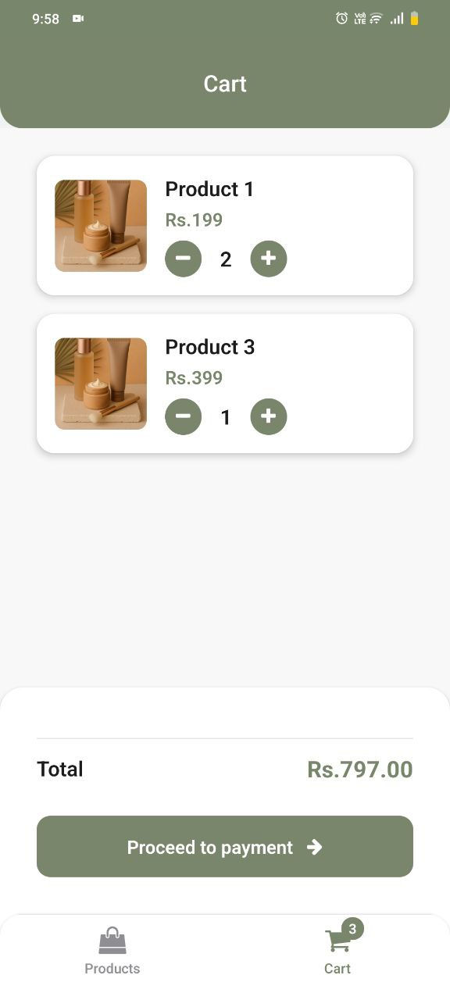

# Welcome to Basic E-commerce app 👋

A modern e-commerce application built with React Native and Expo. This app provides a seamless shopping experience with features like product listing, cart management, and a custom tab navigation system.

## Screenshots
### Dark Mode & Light Mode
<p float="left">
  
  
</p>
## Features

- **Product Listing**: Browse through a list of products with their names and prices.
- **Cart Management**: Add products to the cart, adjust quantities, and view the total price.
- **Custom Tab Navigation**: Navigate between the "Products" and "Cart" screens using a custom tab bar with a badge showing the total number of items in the cart.
- **Redux Integration**: State management is handled using Redux Toolkit for a scalable and maintainable architecture.
- **Reusable Components**: Modular and reusable components like `ProductItem`, `CartItem`, and `CustomTabBar`.


## Get started

1. Install dependencies

   ```bash
   npm install
   ```

2. Start the app

   ```bash
    npx expo start
   ```

In the output, you'll find options to open the app in a

- [development build](https://docs.expo.dev/develop/development-builds/introduction/)
- [Android emulator](https://docs.expo.dev/workflow/android-studio-emulator/)
- [iOS simulator](https://docs.expo.dev/workflow/ios-simulator/)
- [Expo Go](https://expo.dev/go), a limited sandbox for trying out app development with Expo

You can start developing by editing the files inside the **app** directory. This project uses [file-based routing](https://docs.expo.dev/router/introduction).

